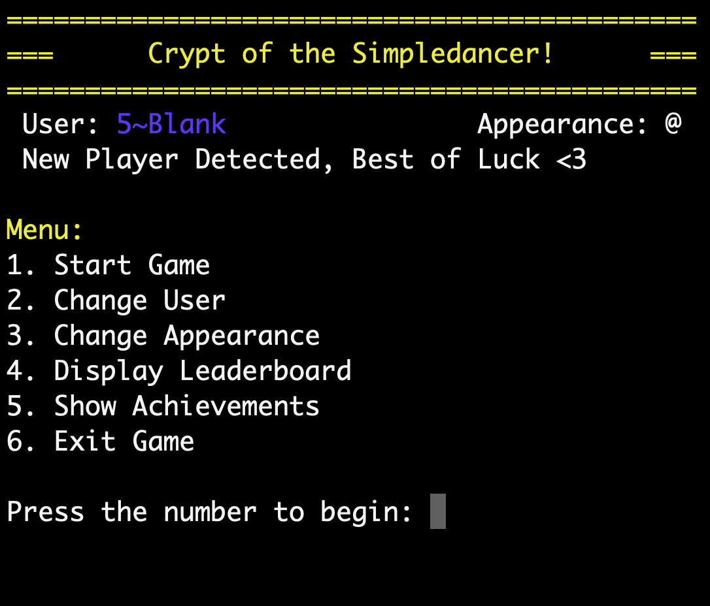

<!-- PROJECT SHIELDS -->
<!--
*** I'm using markdown "reference style" links for readability.
*** Reference links are enclosed in brackets [ ] instead of parentheses ( ).
*** See the bottom of this document for the declaration of the reference variables
*** for contributors-url, forks-url, etc. This is an optional, concise syntax you may use.
*** https://www.markdownguide.org/basic-syntax/#reference-style-links
-->
[![Contributors][contributors-shield]][contributors-url]
[![Forks][forks-shield]][forks-url]
[![Stargazers][stars-shield]][stars-url]
[![Issues][issues-shield]][issues-url]
[![MIT License][license-shield]][license-url]
[![LinkedIn][linkedin-shield]][linkedin-url]

<!-- PROJECT LOGO -->
<br />
<p align="center">
  <a href="https://github.com/justinamaple/Crypt-of-the-Simpledancer">
    
  </a>

  <h3 align="center">Crypt of the Simpledancer</h3>

  <p align="center">
    A simplified CLI roguelike based off of the Crypt of the Necrodancer
    <br />
    <a href="https://github.com/justinamaple/Crypt-of-the-Simpledancer"><strong>Explore the docs »</strong></a>
    <br />
    <br />
    ·
    <a href="https://github.com/justinamaple/Crypt-of-the-Simpledancer/issues">Report Bug</a>
    ·
    <a href="https://github.com/justinamaple/Crypt-of-the-Simpledancer/issues">Request Feature</a>
  </p>
</p>


<!-- TABLE OF CONTENTS -->
## Table of Contents

- [Table of Contents](#table-of-contents)
- [About The Project](#about-the-project)
  - [Built With](#built-with)
- [Introduction](#introduction)
- [Getting Started](#getting-started)
  - [Prerequisites](#prerequisites)
  - [Installation](#installation)
- [Usage](#usage)
- [Roadmap](#roadmap)
- [Game Information](#game-information)
  - [Random Generation](#random-generation)
  - [Controls](#controls)
  - [Game Mechanics](#game-mechanics)
  - [Player](#player)
  - [Weapons](#weapons)
  - [Enemies](#enemies)
    - [Slime - 'O'](#slime---o)
    - [Zombie - 'Z'](#zombie---z)
    - [Bat - 'B'](#bat---b)
    - [Skeleton - 'S'](#skeleton---s)
- [Contributing](#contributing)
- [License](#license)
- [Contact](#contact)

<!-- ABOUT THE PROJECT -->
## About The Project

- Create a simplified version of Crypt of the Necrodancer
- Utilize random generation to spawn rooms and enemies
- Accurately reproduce health, items, and movement mechanics
- Practice dealing with complex State Machines
- Display information neatly to CLI
- Interact with an external API
- Persist data within a DB

### Built With

- [Ruby v2.6.1](https://www.ruby-lang.org/en/downloads/)

<!-- INTRODUCTION -->
## Introduction

A mini-fied CLI rogue-like that implements many mechanics from the amazing [Crypt of the Necrodancer](https://braceyourselfgames.com/crypt-of-the-necrodancer/).

The goal is to capture many of the mechanics and gain deeper insight into game programming, state machines, active record databases, and using a REST API/JSON. This began originally as the final project for my first module at Flatiron School.

<!-- GETTING STARTED -->
## Getting Started

To get a local copy up and running follow these simple steps.

### Prerequisites

- bundler

```sh
install bundler
```

### Installation

1. Clone the Crypt-of-the-Simpledancer

```sh
git clone https:://github.com/justinamaple/Crypt-of-the-Simpledancer.git
```

2. Install Ruby gems

```sh
bundler
```

3. Create the Database

```sh
rake db:migrate
```

4. Run the game

```sh
rake start_game
```

<!-- USAGE EXAMPLES -->
## Usage

1. Run the game
```sh
rake start_game
```

2. Press the corresponding number on the Menu Screen


1. Play the game using the arrow keys


<!-- ROADMAP -->
## Roadmap

See the [open issues](https://github.com/justinamaple/Crypt-of-the-Simpledancer/issues) for a list of proposed features (and known issues).

## Game Information

### Random Generation

The game generates one level at a time. The level is some sort of rectangular shape within a given bounds. The outer edges of the level are 'Walls', invincible objects which block movement.

Once a level has been generated the player is then spawn into a random location near the center. If a level is cleared the player attempts to keep it's current position, but if they are currently near an outer edge and the level shrinks they are just given a new random position.

After the player is placed, the enemies are spawned in. Currently there are several buckets of enemies which can be spawned. The early levels spawn the basic group, as you progress the medium bucket is added, and finally the entire list of enemies is chosen from. As the levels progress the amount of enemies spawned also increases.

The next goal is to create a weapon spawn on every odd floor. It will occupy a random tile that is spawned in after the player and enemies. Enemies can stand on top of the tile to cover it, while when a player steps on it, it will be consumed. The player will be given a random weapon that lasts until another is picked or the game concludes.

### Controls

The menu's are handled mostly through single character inputs. A list of the options and their respective number's will be displayed. 

Once the game has started, use the arrow keys to move around. You can only move in the cardinal directions. If you would like to end a run early, hit 'Q' to end the game. This will let you either start a new run, or return to the main menu.

The display screen consists of two lines of text at the top of the screen. The first is a summary of your actions the last turn, the latter is a summary of the enemies actions. Below that, the map is displayed in a grid format. Finally at the bottom are your stats and input options.

### Game Mechanics

Most of the mechanics are pulled directly from Crypt of the Necrodancer.

The game is essentially turn based, where the player move's first and the enemies right after. The enemies can move in a pattern, randomly, or in response to the player. Symbols, or Characters, represent a enemy class. i.e. Slime's are 'O', but each color Slime will behave differently. The timing mechanic of pressing beats at a certain time has not been implemented as of yet. Combo's were just introduced and are gained by killing an enemy, and removed when taking damage or hitting a wall.

To clear a level simply defeat all of the enemies. This will spawn you into the next level. Achievements will be rewarded for skillful play. i.e. maintaining a high combo, clearing the game fast, beating a certain number of enemies.

Runs are all saved to the Database, and belong to a user. Achievements are then Unlocked by a User off their run(s).

### Player

You will spawn in the level with 3 hearts and a Dagger. The default appearance is the '@' character, but you are free to change it to any unicode character. (Emoji's are awkward but work).

### Weapons

Currently the only weapon is the Dagger, which enables attacking one space away in a cardinal direction, remaining in the same place after attacking.

In the near future I would like to add

- Broadsword
- Spear
- Longsword
- Whip
- Flail
- Crossbow
- ???

### Enemies

Enemies are spawned into the level randomly at least 1 tile away from the walls. Each enemy has a type and color, which can affect both stats and movement patterns. These are all nearly identical to their Crypt of the Necrodancer counterparts, however some changes might be required since you cannot tell what direction the enemies are facing.

#### Slime - 'O'

- Green Slime: Hops in one place, has 1 HP.
- Blue Slime: Hops up and down one space every other turn, has 2 HP. Turn's into an 'o' after being hit.
- Orange Slime: Hops in a clockwise direction every turn, has 1 HP.

#### Zombie - 'Z'

- Zombie: Moves cardinally every other turn until facing a wall, then flips direction. Has 1 HP

#### Bat - 'B'

- Blue Bat: Moves randomly in a cardinal direction of possible every other turn. Has 1 HP
- Red Bat: Moves randomly in a cardinal direction of possible every turn. Has 1 HP

#### Skeleton - 'S'

- White Skeleton: Move's toward the player every other turn. Has 1 HP.
- Yellow Skeleton: Move's toward the player every other turn. Has 2 HP. Turn's into an 's' after being hit.
- Black Skeleton: Move's toward the player every other turn. Has 3 HP. Goes from '$' -> 'S' -> 's'.

<!-- CONTRIBUTING -->
## Contributing

Contributions are what make the open source community such an amazing place to be learn, inspire, and create. Any contributions you make are **greatly appreciated**.

However as this is a personal project, the goal is mainly for me to implement the new functionality myself!

1. Fork the Project
2. Create your Feature Branch (`git checkout -b feature/AmazingFeature`)
3. Commit your Changes (`git commit -m 'Add some AmazingFeature'`)
4. Push to the Branch (`git push origin feature/AmazingFeature`)
5. Open a Pull Request

<!-- LICENSE -->
## License

Distributed under the MIT License. See `LICENSE` for more information.

<!-- CONTACT -->
## Contact

Justin Maple - [@J3ubbleboy](https://twitter.com/J3ubbleboy) - justinamaple@gmail.com

Project Link: [https://github.com/justinamaple/Crypt-of-the-Simpledancer](https://github.com/justinamaple/Crypt-of-the-Simpledancer)

<!-- MARKDOWN LINKS & IMAGES -->
<!-- https://www.markdownguide.org/basic-syntax/#reference-style-links -->
[contributors-shield]: https://img.shields.io/github/contributors/othneildrew/Best-README-Template.svg?style=flat-square
[contributors-url]: https://github.com/othneildrew/Best-README-Template/graphs/contributors
[forks-shield]: https://img.shields.io/github/forks/othneildrew/Best-README-Template.svg?style=flat-square
[forks-url]: https://github.com/othneildrew/Best-README-Template/network/members
[stars-shield]: https://img.shields.io/github/stars/othneildrew/Best-README-Template.svg?style=flat-square
[stars-url]: https://github.com/othneildrew/Best-README-Template/stargazers
[issues-shield]: https://img.shields.io/github/issues/othneildrew/Best-README-Template.svg?style=flat-square
[issues-url]: https://github.com/othneildrew/Best-README-Template/issues
[license-shield]: https://img.shields.io/github/license/othneildrew/Best-README-Template.svg?style=flat-square
[license-url]: https://github.com/othneildrew/Best-README-Template/blob/master/LICENSE.txt
[linkedin-shield]: https://img.shields.io/badge/-LinkedIn-black.svg?style=flat-square&logo=linkedin&colorB=555
[linkedin-url]: https://linkedin.com/in/othneildrew
[product-screenshot]: images/screenshot.png
